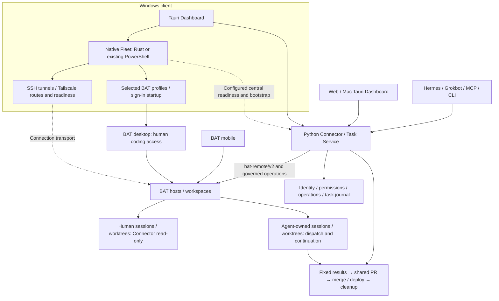

# Better Agent Dashboard

**Keep track of your coding agents, from the original request to reviewed delivery.**

**English** · [繁體中文](README.zh-TW.md) · [Website](https://teddashh.github.io/bat-agent-connector/) · [Getting started](docs/getting-started.md)

Better Agent Dashboard brings together **Windows Fleet connectivity and startup, agent work on BAT hosts, and delivery**. Native Windows Fleet manages selected connections, SSH tunnels, BAT profiles and sign-in startup. Python Connector / Task Service dispatches work and tracks operations. The **shared Web and Tauri Dashboard** shows hosts, sessions, worktrees, projects and results through PR and deployment.

You continue coding in [Better Agent Terminal (BAT)](https://github.com/tony1223/better-agent-terminal). Agents such as Hermes and Grokbot use their own identities to work alongside you. The repository and Python package retain the name **`bat-agent-connector`**: Connector is the shared backend for the Dashboard, CLI and MCP tools.

> **Product direction:** install the desktop package, let it prepare and run the background service, connect your BAT environment, then open the Dashboard with one click. **Current implementation:** the shared Dashboard and background central service exist, but are pending final validation (draft PR #81). The candidate source now implements the bundled managed runtime, auto personal identity, and a browser one-use ticket. [Installation status and trial paths →](docs/getting-started.md)


*Actual shared frontend with synthetic demonstration data, captured from the shared project workspace implementation (October 10, 2026). This is an interface illustration, not a live-host acceptance result. [Screenshot provenance](site/images/README.md).*

Select a project or work item in the persistent left tree. The selected session opens its conversation, reply controls and linked results together. Global management views remain under **Tools**; **Connection** retains Windows Fleet and local startup controls.

## Explore

[Capabilities](#what-you-can-do) · [Workflow](#from-request-to-delivery) · [Architecture](#web-desktop-and-agents) · [Windows Fleet](#windows-fleet-and-resources) · [Platforms](#platforms-and-packages) · [Start](#start-using-it) · [Trust and recovery](#permissions-ownership-and-recovery) · [Readiness](#current-evidence-and-remaining-work) · [Documentation](#documentation) · [Development](#development)

## What you can do

| Your question | Where to go | What you get |
| --- | --- | --- |
| What connects and opens at Windows sign-in? | **Connection settings / Fleet** | Independent background connections, BAT profiles and Dashboard choices; tunnel / BAT / central readiness, Tailscale sign-in, active backend and launch / migration receipts. |
| What needs me right now? | **Pending** | Separate replies / permissions, completion review, operation problems and host connections. Idle does not mean the task is complete. |
| What belongs to this project? | **Left project tree** | Work items, original instructions, acceptance criteria, repository bindings and dispatched work. Hierarchy, pins and archive keep ongoing projects organized. |
| Can I start the next piece of work? | **Project dispatch / Sessions** | Select a configured repository, host and workspace; preview a fixed commit; add instructions, model and attachments; create a managed session. |
| What is an agent doing? | **Selected work / conversation** | Recent conversation, readable code and tables, pending questions, resource ownership and freshness. Authorized controls use central operations. |
| What did it produce? | **Artifacts / work details** | Immutable revisions, digests, capture, review and links to the originating operation, execution or task. Accepting an artifact does not merge code or complete a task. |
| How do results reach the same PR? | **Delivery** | Preview fixed results from managed work, checkpoints or branches, then integrate them in a separate workspace. Paste a GitHub PR URL to load its configured repository. |
| Has it actually shipped? | **Delivery** | Separate integration, merge and deployment receipts. Configured recipes check the deployed source version and runtime evidence. |
| Can I free this worktree? | **Cleanup and retained work** | Review exact resources, preserved content and reasons preventing removal. History and relationships remain after eligible cleanup. |
| What happened during a disconnect? | **Operations / history** | Durable IDs, original requests and receipts. Read back the original operation instead of dispatching again because its reply was lost. |

Features are exposed according to the current account, host and repository configuration. The interface explains unavailable actions. Ordinary project dispatch does not require creating a second Task Service recipe for every request.

## From request to delivery

1. **Organize the project.** Explicitly associate a configured repository, preserve the request and record acceptance criteria.
2. **Choose the destination.** Select the BAT host and workspace. For published code, preview a branch such as `main` and confirm its fixed commit. Switching clients does not move the work.
3. **Start the agent's own work.** Instructions, optional model and exact attachment revisions travel with the operation. Connector keeps the person's original checkout read-only.
4. **Follow the result from the project.** Find the dispatched work, session, operation and delivery entry. “Started” means a start succeeded; activity, verification, acceptance and delivery are distinct.
5. **Review and integrate.** Inspect candidate commits and the integration preview. Bring selected results into one PR, then review and merge its fixed scope with an authorized identity.
6. **Deploy and tidy up.** Where a recipe is configured, follow the merged source to runtime version / health evidence. Review eligible cleanup while preserving history and retained results.

Same-host continuation can use a fixed local checkpoint. Another host gets code through an **explicitly bound GitHub repository and a published commit**. Unpublished workspaces are not moved between machines, and a person's checkout is not automatically pulled or reset.

## Web, desktop and agents



**These responsibilities are distinct and all remain part of the product.** Windows Fleet owns local connectivity, readiness and startup; Connector owns dispatch, permissions and the journal; BAT runs coding sessions on the selected hosts. Human BAT desktop / mobile access and agent-owned managed resources both remain explicit. GitHub carries published code and reviewed delivery.

Project Hub is a reference for session organization and interaction. Its runtime, data backend and importer are not part of this architecture. Sharing the Dashboard with Mac / Web does not port Windows-native Fleet controls to those platforms.

**One frontend, one central authority.** Web and Tauri are built from `desktop/src`. Python serves `/dashboard/` and `/api/v1`. Tauri bundles the same UI and uses a restricted Rust transport. It does not create a second business backend, scheduler or journal.

- Both clients can be open at once. Closing a browser tab or Dashboard window does not stop the central service's work. Closing a local tunnel can disconnect that client.
- Projects, work items, operations and versioned work-item reading markers use central state. Drafts and conversation reading positions remain local to each client.
- Native credentials, files, tray / Dock behavior, Fleet and updates depend on platform support. Browser access does not grant local machine control.
- MCP and CLI share central policies and durable operations. Each automation client uses its own principal and scopes.

The intended installer owns the lifecycle of its managed local service: initial runtime and identity setup, background startup, connection recovery and a one-click browser entry. An **existing central connection is an advanced join path**, not the intended first step for a new user. This installer work is not yet complete; [the first-run contract](docs/design/managed-installation.md) defines the remaining behavior.

[Shared frontend](docs/design/shared-frontend.md) · [Native client](docs/design/desktop.md) · [API](docs/design/api-v1.md)

## Windows Fleet and resources

Windows remains a core part of the product. Sharing the Dashboard with Web / Mac retains these integrated native Fleet capabilities:

| Capability | Existing implementation and entry point |
| --- | --- |
| Background connections and routes | Maintain selected tunnels from the existing inventory / SSH / profile bindings; check Tailscale and configured routes; use bounded recovery without taking over unknown processes. |
| BAT and central readiness | Distinguish tunnel, pinned TLS, BAT identity / workspace and central observe access. An open port alone is not readiness. |
| Windows and sign-in | Independent connection, BAT profile and Dashboard choices; login picker, saved launch choices, close-to-background and single-window restoration. |
| Backend and ownership | Rust runtime is integrated. Existing configuration without a backend retains PowerShell; explicit migration proves the old owner stopped before starting the replacement. |
| Tailscale and central startup | Read Tailscale state and open its installed sign-in app; a separately configured fixed SSH recipe can query / start the selected central service. This is not arbitrary remote installation. |
| Local resources | Windows Credential Manager, native attachment selection / upload / Save As, tray and controlled update entry. |

**Windows Fleet and central have separate platform requirements.** Today's Windows client can connect to Linux central. Automatic installation of the complete runtime remains separate delivery work. Mac DMG / Keychain evidence does not replace Windows Fleet live acceptance.

[Windows usage and resources](docs/windows.md) · [NSIS validation packages](https://github.com/teddashh/bat-agent-connector/actions/workflows/desktop.yml) · [Fleet configuration example](desktop/fleet.example.json) · [Rust Fleet source](desktop/fleet-core/README.md)

## Platforms and packages

The **desktop client** and **central service** have different platform requirements today.

| Component | Available evidence | Current limit |
| --- | --- | --- |
| Web Dashboard | Responsive English / Traditional Chinese interface, served by central | Uses trusted loopback / tunnel access. Public or LAN hosting needs a separate authenticated ingress design. |
| Windows desktop | x64 NSIS, Credential Manager, native Fleet / BAT profile / sign-in controls; installed WebView and lifecycle tests in CI | Full live Fleet acceptance remains; no bundled / automatically provisioned Python central yet. |
| macOS desktop | Apple Silicon and Intel DMGs; native WebView, lifecycle and isolated Keychain tests | Ad-hoc validation signing. Developer ID / notarization and an operational Mac updater remain release work; Windows Fleet parity is not implied. |
| Linux desktop | Debian validation package and native WebView fixture | Native credentials currently use a memory-only source; persistent protected enrollment is not implemented. |
| Python central / CLI / MCP | Python 3.10–3.13 tested on Linux; POSIX implementation | Linux is the documented central setup path. Windows-native central is not implemented. Mac client tests do not establish Mac central live acceptance. |

Download validation packages under **Artifacts** in a successful [desktop workflow run](https://github.com/teddashh/bat-agent-connector/actions/workflows/desktop.yml). Match the source commit and central compatibility. GitHub may require sign-in, and artifacts expire; this is not a stable release channel.

The [2026-10-10 candidate CI build](https://github.com/teddashh/bat-agent-connector/actions/workflows/desktop.yml) provides candidate artifacts from PR #81. The candidate implements the bundled managed runtime, auto personal identity generation, and browser one-use tickets. Note that installed release assets from earlier runs remain clearly historical client validation and do not automatically bundle the new runtime.

## Start using it

**The normal path** is now implemented in the candidate: install the candidate matching the successful PR81 CI artifact, launch it, and the owned local background central and personal credential (native-only) are automatically prepared.

For a **supervised trial today**, use this candidate path:

1. **Install and Launch:** Download and install the candidate artifact. It automatically prepares the background service and your personal credentials.
2. **Connect BAT:** In the UI Settings, either add a trusted BAT profile, or manually enter the URL, fingerprint, workspace profile, and token. Credentials never hand-edit JSON.
3. **Bind GitHub:** Select a host/workspace and set up the GitHub binding in the UI.
   - For published-repo dispatch, managed roots and an SSH trusted alias are required.
   - For BAT direct starts, a shared-clone-worktree is an explicit opt-in.
4. **Agent observation:** Register `bat-agent-connector-mcp` in its MCP client. Give authorized automation its own scoped `BATC_API_TOKEN`.

*Note: The manual external central setup remains preserved as an advanced choice.*

Working on remote BAT hosts does not require BAT to be installed on the Dashboard machine. [Canonical skill and Hermes / Grokbot adapters](docs/agent-skills.md).

## Permissions, ownership and recovery

**Host access and account permissions are separate.** Host `writes` / `orchestrate` settings allow classes of work. API scopes authorize an identity's actions. Resource ownership, current versions, repository bindings and task coordinator checks still apply.

| Resource or outcome | Behavior |
| --- | --- |
| Human-created session / worktree | Read-only through Connector. Continue from a reviewed fixed source in new managed resources. |
| Unknown ownership | Stay unknown unless existing creation evidence proves ownership. A matching path is insufficient. |
| Managed work | Authorized actions pass the central handler and coordinator rules. |
| Reply lost after dispatch | Retain the operation, original key and reservations; read back the result. A timeout does not prove failure. |
| Agent claims completion | Present for review. Acceptance is distinct from activity, verification, merge and deploy. |
| Cleanup touches active / unresolved work | Keep it and explain why; do not clear uncertain operations or erase their history. |

MCP / CLI writes retain explicit confirmation, host tiers and audit records. The UI's reviewed actions go through central directly, without an extra LLM approval step.

**Read-only Connector policy is not an OS sandbox.** Host accounts and confinement determine whether an agent process can write to human directories. General starts and Task Service recipes have documented differences. Read [confinement](docs/design/confinement.md) before relying on unattended isolation.

A native BAT `worktree.merge` with a fully unknown ACK and insufficient positive evidence still lacks a complete human adjudication API. This limitation is specific; GitHub integration and deployment have their own readback contracts. [Merge recovery](docs/design/worktree-merge.md) · [Resource policy](docs/design/resource-policy.md) · [Security](SECURITY.md)

## Current evidence and remaining work

Baseline: **2026-10-10, candidate source from PR #81**. The normal first-launch setup is now implemented.

| Evidence | What it establishes |
| --- | --- |
| [Python CI](https://github.com/teddashh/bat-agent-connector/actions/runs/38032723049) | Python 3.10–3.13 passed; the local 3.13 full run recorded 3,228 passed / 33 skipped. |
| Shared frontend checks | 694 UI cases passed before final affected-layout regressions. HTTP / native transport fixtures test behavior. |
| [Desktop CI](https://github.com/teddashh/bat-agent-connector/actions/workflows/desktop.yml) | Windows, both Mac architectures and Linux packaging / native fixtures. Installed fixtures use controlled loopback services and synthetic data. |
| Real central integration fixtures | Actual Python API, journal and temporary Git, with fake BAT / GitHub providers. |

Note: Formal signing, Mac notarization, update channels, Linux persistent vaults, and user-run human acceptance are exclusions and not implemented features. The remaining delivery work includes the specific unknown-ACK recovery flow.

[Implementation record](docs/product/implementation-status.md) · [Acceptance matrix](docs/product/acceptance-v2.md)

## Documentation

| Area | Guides |
| --- | --- |
| Getting started | [English](docs/getting-started.md) · [繁體中文](docs/getting-started.zh-TW.md) · [Configuration example](examples/hosts.example.toml) |
| Product and installation | [Shared decisions](docs/product/realignment-v2.md) · [Managed installation requirement](docs/design/managed-installation.md) · [Work items](docs/design/work-items.md) |
| Desktop / Web | [Shared frontend](docs/design/shared-frontend.md) · [Tauri](docs/design/desktop.md) · [Fleet](docs/design/desktop-fleet-native.md) · [Updates](docs/design/desktop-updates.md) |
| Windows / Fleet | [Usage and resources](docs/windows.md) · [Sign-in / windows](docs/design/desktop-fleet-native.md) · [Routes](docs/design/fleet-routes.md) · [Tailscale](docs/design/tailscale-recovery.md) · [Central bootstrap](docs/design/fleet-bootstrap.md) |
| Dispatch | [Managed start](docs/design/session-start.md) · [Published repositories](docs/design/repository-sync.md) · [Checkpoints](docs/design/checkpoints.md) · [Task Service](docs/design/task-service.md) |
| Results | [Artifacts](docs/design/artifacts.md) · [Integration](docs/design/integration.md) · [Merge / deployment](docs/design/delivery.md) · [Cleanup](docs/design/cleanup.md) |
| Automation | [API](docs/design/api-v1.md) · [Operations](docs/design/operations-unification.md) · [Agent skills](docs/agent-skills.md) · [Protocol](docs/PROTOCOL.md) |

## Development

```bash
uv sync --locked --extra dev
uv run ruff check .
pytest-disktmp uv run pytest -q

cd desktop
npm ci
npm run build:all
npm test
npm run test:ui
```

`pytest-disktmp` is the development host's disk-temp wrapper. If unavailable, use a unique disk-backed `--basetemp` and delete it on exit; never use `/dev/shm` or another tmpfs. See [CONTRIBUTING](CONTRIBUTING.md) and [AGENTS.md]. Backend changes also require the Python 3.10 suite.

Edit shared UI in `desktop/src` and regenerate browser assets. The public project site lives in `site/`; see [site maintenance](site/README.md). Automated tests must not write to live BAT hosts.

## Credits and license

An unofficial companion, **not affiliated with or endorsed by BAT's authors**. BAT is by [TonyQ / tony1223](https://github.com/tony1223) and contributors. Protocol notes were originally read from BAT v3.2.12; compatibility must be checked as BAT evolves.

[Project Hub](https://github.com/kieiken/project-hub) informs selected organization and interaction patterns. No Hub snapshot importer or runtime dependency is included. [Adoption review](docs/product/project-hub-frontend-audit-2026-10-09.md).

MIT · [LICENSE](LICENSE) · [Third-party notices](THIRD_PARTY_NOTICES.md) · [Changelog](CHANGELOG.md)
