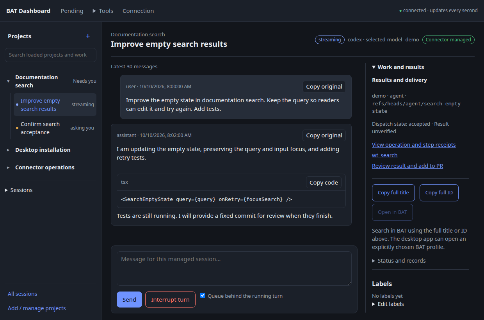
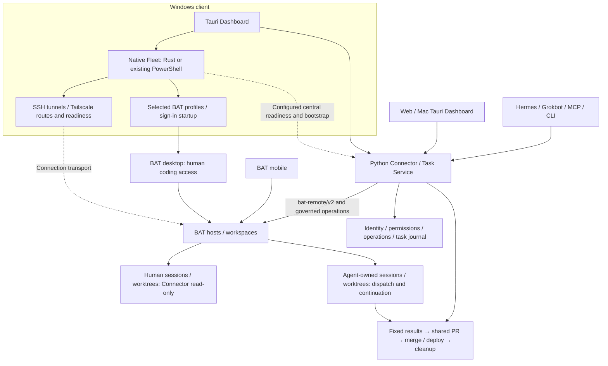

# Better Agent Dashboard

**Keep track of your coding agents, from the original request to reviewed delivery.**

**English** · [繁體中文](README.zh-TW.md) · [Website](https://teddashh.github.io/bat-agent-connector/) · [Getting started](docs/getting-started.md)

Better Agent Dashboard brings together **Windows Fleet connectivity and startup, agent work on BAT hosts, and delivery**. Native Windows Fleet manages selected connections, SSH tunnels, BAT profiles and sign-in startup. Python Connector / Task Service dispatches work and tracks operations. The **shared Web and Tauri Dashboard** shows hosts, sessions, worktrees, projects and results through PR and deployment.

You continue coding in [Better Agent Terminal (BAT)](https://github.com/tony1223/better-agent-terminal). Agents such as Hermes and Grokbot use their own identities to work alongside you. The repository and Python package retain the name **`bat-agent-connector`**: Connector is the shared backend for the Dashboard, CLI and MCP tools.

> **This source version** includes the bundled Python runtime, owned background central, personal identity and authenticated browser entry introduced in [PR #81](https://github.com/teddashh/bat-agent-connector/pull/81). Use a successful desktop artifact matching the source commit and check its validation records. Earlier release downloads do not gain these features automatically. [Installation and first use →](docs/getting-started.md)



*Actual shared frontend with synthetic demonstration data, captured from the shared project workspace implementation (October 10, 2026). This is an interface illustration, not a live-host acceptance result. [Screenshot provenance](site/images/README.md).*

Select a project or work item in the persistent left tree. The selected session opens its conversation, reply controls and linked results together. Global management views remain under **Tools**; **Connection** retains Windows Fleet and local startup controls.

## Explore

[Capabilities](#what-you-can-do) · [Workflow](#from-request-to-delivery) · [Architecture](#web-desktop-and-agents) · [Windows Fleet](#windows-fleet-and-resources) · [Platforms](#platforms-and-packages) · [Start](#start-using-it) · [Trust and recovery](#permissions-ownership-and-recovery) · [Validation](#implementation-and-validation) · [Documentation](#documentation) · [Development](#development)

## What you can do

| Your question | Where to go | What you get |
| --- | --- | --- |
| What connects and opens at Windows sign-in? | **Connection settings / Fleet** | Independent background connections, BAT profiles and Dashboard choices; tunnel / BAT / central readiness, Tailscale sign-in, active backend and launch / migration receipts. |
| What needs me right now? | **Pending** | Separate replies / permissions, completion review, operation problems and host connections. Idle does not mean the task is complete. |
| What belongs to this project? | **Left project tree** | Work items, original instructions, acceptance criteria, repository bindings and dispatched work. Hierarchy, pins and archive keep ongoing projects organized. |
| Can I start the next piece of work? | **Project dispatch / Sessions** | Select a configured repository, host and workspace; preview a fixed commit; add instructions, model and attachments; create a managed session. |
| What is an agent doing? | **Selected work / conversation** | Recent conversation, readable code and tables, pending questions, resource ownership and freshness. Authorized controls use central operations. |
| What did it produce? | **Artifacts / work details** | Immutable revisions, digests, capture, review and links to the originating operation, execution or task. Accepting an artifact does not merge code or complete a task. |
| How do results reach the same PR? | **Delivery** | Preview fixed results from managed work, checkpoints or branches, then integrate them in a separate workspace. Paste a GitHub PR URL to load its configured repository. |
| Has it actually shipped? | **Delivery** | Separate integration, merge and deployment receipts. Configured recipes check the deployed source version and runtime evidence. |
| Can I free this worktree? | **Cleanup and retained work** | Review exact resources, preserved content and reasons preventing removal. History and relationships remain after eligible cleanup. |
| What happened during a disconnect? | **Operations / history** | Durable IDs, original requests and receipts. Read back the original operation instead of dispatching again because its reply was lost. |

Features are exposed according to the current account, host and repository configuration. The interface explains unavailable actions. Ordinary project dispatch does not require creating a second Task Service recipe for every request.

## From request to delivery

1. **Organize the project.** Explicitly associate a configured repository, preserve the request and record acceptance criteria.
2. **Choose the destination.** Select the BAT host and workspace. For published code, preview a branch such as `main` and confirm its fixed commit. Switching clients does not move the work.
3. **Start the agent's own work.** Instructions, optional model and exact attachment revisions travel with the operation. Connector keeps the person's original checkout read-only.
4. **Follow the result from the project.** Find the dispatched work, session, operation and delivery entry. “Started” means a start succeeded; activity, verification, acceptance and delivery are distinct.
5. **Review and integrate.** Inspect candidate commits and the integration preview. Bring selected results into one PR, then review and merge its fixed scope with an authorized identity.
6. **Deploy and tidy up.** Where a recipe is configured, follow the merged source to runtime version / health evidence. Review eligible cleanup while preserving history and retained results.

Same-host continuation can use a fixed local checkpoint. Another host gets code through an **explicitly bound GitHub repository and a published commit**. Unpublished workspaces are not moved between machines, and a person's checkout is not automatically pulled or reset.

## Web, desktop and agents



**These responsibilities are distinct and all remain part of the product.** Windows Fleet owns local connectivity, readiness and startup; Connector owns dispatch, permissions and the journal; BAT runs coding sessions on the selected hosts. Human BAT desktop / mobile access and agent-owned managed resources both remain explicit. GitHub carries published code and reviewed delivery.

Project Hub is a reference for session organization and interaction. Its runtime, data backend and importer are not part of this architecture. Sharing the Dashboard with Mac / Web does not port Windows-native Fleet controls to those platforms.

**One frontend, one central authority.** Web and Tauri are built from `desktop/src`. Python serves `/dashboard/` and `/api/v1`. Tauri bundles the same UI and uses a restricted Rust transport. It does not create a second business backend, scheduler or journal.

- Both clients can be open at once. Closing a browser tab or Dashboard window does not stop the central service's work. Closing a local tunnel can disconnect that client.
- Projects, work items, operations and versioned work-item reading markers use central state. Drafts and conversation reading positions remain local to each client.
- Native credentials, files, tray / Dock behavior, Fleet and updates depend on platform support. Browser access does not grant local machine control.
- MCP and CLI share central policies and durable operations. Each automation client uses its own principal and scopes.

The candidate installer bundles the matching Python runtime and prepares one owned local service, private data and personal identity on first launch. It supports background startup, verified reconnection and authenticated browser entry. Reopening and safe upgrades preserve the same installation and journal. **Joining an existing central is an advanced option**; an existing connection configuration is preserved, and connection failure never provisions a replacement database. [Installation and recovery contract](docs/design/managed-installation.md).

[Shared frontend](docs/design/shared-frontend.md) · [Native client](docs/design/desktop.md) · [API](docs/design/api-v1.md)

## Windows Fleet and resources

Windows remains a core part of the product. Sharing the Dashboard with Web / Mac retains these integrated native Fleet capabilities:

| Capability | Existing implementation and entry point |
| --- | --- |
| Background connections and routes | Maintain selected tunnels from the existing inventory / SSH / profile bindings; check Tailscale and configured routes; use bounded recovery without taking over unknown processes. |
| BAT and central readiness | Distinguish tunnel, pinned TLS, BAT identity / workspace and central observe access. An open port alone is not readiness. |
| Windows and sign-in | Independent connection, BAT profile and Dashboard choices; login picker, saved launch choices, close-to-background and single-window restoration. |
| Backend and ownership | Rust runtime is integrated. Existing configuration without a backend retains PowerShell; explicit migration proves the old owner stopped before starting the replacement. |
| Tailscale and central startup | Read Tailscale state and open its installed sign-in app; a separately configured fixed SSH recipe can query / start the selected central service. This is not arbitrary remote installation. |
| Local resources | Windows Credential Manager, native attachment selection / upload / Save As, tray and controlled update entry. |

**Windows Fleet and central have separate responsibilities.** The candidate runs its bundled central locally on Windows, or joins a configured external central. Fleet keeps its own explicit connection, profile and ownership settings. Mac supports the shared Dashboard and bundled central; Windows Fleet remains a Windows capability.

[Windows usage and resources](docs/windows.md) · [NSIS validation packages](https://github.com/teddashh/bat-agent-connector/actions/workflows/desktop.yml) · [Fleet configuration example](desktop/fleet.example.json) · [Rust Fleet source](desktop/fleet-core/README.md)

New Windows Fleet installations can use the native Rust backend with the
[public configuration templates](docs/design/fleet-configuration.md). Supply your own
hosts, SSH aliases and BAT profiles; no maintainer inventory or private Kit checkout is
required. PowerShell remains an optional compatibility backend for existing installations.

## Platforms and packages

This source version defines packaging for the following platforms. Match CI and installed-fixture evidence to the exact source commit; implementation, a successful package job and a real user environment are separate evidence.

| Component | Candidate implementation | Distribution or platform boundary |
| --- | --- | --- |
| Web Dashboard | Shared English / Traditional Chinese UI served by central; one-click authenticated entry from the managed desktop | Uses trusted loopback / tunnel access; no general public-hosting ingress. |
| Windows x64 | NSIS with bundled central, private Windows storage / file locks, Credential Manager for external-central credentials, native Fleet and tray | Validation package is unsigned. |
| macOS Apple Silicon / Intel | DMGs with bundled central, browser entry, menu bar and Keychain for external-central credentials | Ad-hoc validation signing; no Windows Fleet port. |
| Linux | Debian package, bundled central and native WebView | External-central native credentials use the memory-only adapter; a persistent Linux credential vault is outside this delivery. |
| Python central / CLI / MCP | One operation authority; Windows private storage and locking plus POSIX support; Python 3.10–3.13 CI matrix | Manual operator deployment remains available. Desktop users do not need a preinstalled Python runtime. |

Open [PR #81 checks](https://github.com/teddashh/bat-agent-connector/pull/81/checks), follow its [desktop workflow](https://github.com/teddashh/bat-agent-connector/actions/workflows/desktop.yml), and match the artifact's source commit and successful platform job. GitHub may require sign-in, and artifacts expire. These are candidate artifacts, not a newly published stable release or update channel; older release assets remain historical client packages.

## Start using it

With a matching candidate package:

1. **Install and launch.** The app prepares its local background central and personal identity. No Python / uv installation, endpoint entry or API-token copying is needed for this local path.
2. **Connect BAT.** Open **Connection / Fleet → Get ready to work → Connect BAT**. Select an importable BAT connection profile, or enter the endpoint, trusted certificate fingerprint, workspace profile ID and BAT token. Use **Verify and save host**.
3. **Choose where managed work may run.** Enable the intended conversation / start permissions, choose dedicated remote managed directories, and provide the existing trusted SSH alias used for Git and artifact operations. **Allow Git worktrees sharing a clone** is a separate explicit choice for direct BAT starts that need it; human resources remain read-only.
4. **Bind the repository.** Under **Bind a GitHub repository**, read the host's workspaces and choose the exact workspace ID. Supply the GitHub repository, Git remote and authorization, then **Verify and bind repository**. Saving checks access without pushing or opening a PR.
5. **Start and follow work.** Associate a project with that binding, review a fixed source commit and dispatch. Use **Configure verification commands** only when configuring Task Service projects; saving a command does not execute it. [Detailed setup and recovery](docs/getting-started.md).

Use **Open Dashboard in browser** or the tray / menu-bar entry for authenticated browser access, and **Start when I sign in** for installation-owned startup. Existing external-central configuration remains active; **Advanced: join an existing central** lets you choose another trusted service explicitly. Agents receive their own scoped central identities through the [MCP setup](docs/getting-started.md#cli-and-agent-access).

Working on remote BAT hosts does not require BAT to be installed on the Dashboard machine. [Canonical skill and Hermes / Grokbot adapters](docs/agent-skills.md).

## Permissions, ownership and recovery

**Host access and account permissions are separate.** Host `writes` / `orchestrate` settings allow classes of work. API scopes authorize an identity's actions. Resource ownership, current versions, repository bindings and task coordinator checks still apply.

| Resource or outcome | Behavior |
| --- | --- |
| Human-created session / worktree | Read-only through Connector. Continue from a reviewed fixed source in new managed resources. |
| Unknown ownership | Stay unknown unless existing creation evidence proves ownership. A matching path is insufficient. |
| Managed work | Authorized actions pass the central handler and coordinator rules. |
| Reply lost after dispatch | Retain the operation, original key and reservations; read back the result. A timeout does not prove failure. |
| Agent claims completion | Present for review. Acceptance is distinct from activity, verification, merge and deploy. |
| Cleanup touches active / unresolved work | Keep it and explain why; do not clear uncertain operations or erase their history. |

MCP / CLI writes retain explicit confirmation, host tiers and audit records. The UI's reviewed actions go through central directly, without an extra LLM approval step.

**Read-only Connector policy is not an OS sandbox.** Host accounts and confinement determine whether an agent process can write to human directories. General starts and Task Service recipes have documented differences. Read [confinement](docs/design/confinement.md) before relying on unattended isolation.

For native BAT `worktree.merge`, an unknown ACK without sufficient positive evidence preserves the original operation and resources; it does not resend or release ownership. A human-adjudication API for that case is outside the current contract, not a remaining delivery gate. GitHub integration and deployment use their own readback contracts. [Merge recovery](docs/design/worktree-merge.md) · [Resource policy](docs/design/resource-policy.md) · [Security](SECURITY.md)

## Implementation and validation

The implementation described here was introduced in [PR #81](https://github.com/teddashh/bat-agent-connector/pull/81). Its [checks](https://github.com/teddashh/bat-agent-connector/pull/81/checks) record validation for the corresponding commits. Match those records to the package you use; older release test totals or artifacts do not establish this source version.

The candidate includes managed installation and onboarding, an adjustable project tree, readable conversations and send receipts, unread / model preferences, reviewed skill selections, linked results and repair work. Skill selection records a fixed source digest; it does not activate a skill in a running agent. A historical queued-send receipt does not report the current BAT queue position or offer per-message cancellation.

Automated validation covers Python, shared browser/native transport, packaged runtime ownership and restart, and platform installation fixtures. These controlled fixtures are distinct from a user's actual Fleet, accounts and deployment targets.

The owner excluded **formal signing, Mac notarization, production update channels and Linux persistent native credential storage** from this delivery. **Human execution of the full 46-item real-environment acceptance matrix belongs to the user** and is not an outstanding agent task. These exclusions are not claims that the corresponding capabilities or real-host tests were completed. Consult the linked PR and checks for validation and integration records.

[Implementation record](docs/product/implementation-status.md) · [Acceptance reference](docs/product/acceptance-v2.md)

## Documentation

| Area | Guides |
| --- | --- |
| Getting started | [English](docs/getting-started.md) · [繁體中文](docs/getting-started.zh-TW.md) · [Configuration example](examples/hosts.example.toml) |
| Product and installation | [Shared decisions](docs/product/realignment-v2.md) · [Managed installation requirement](docs/design/managed-installation.md) · [Work items](docs/design/work-items.md) |
| Desktop / Web | [Shared frontend](docs/design/shared-frontend.md) · [Tauri](docs/design/desktop.md) · [Fleet](docs/design/desktop-fleet-native.md) · [Updates](docs/design/desktop-updates.md) |
| Windows / Fleet | [Usage and resources](docs/windows.md) · [Sign-in / windows](docs/design/desktop-fleet-native.md) · [Routes](docs/design/fleet-routes.md) · [Tailscale](docs/design/tailscale-recovery.md) · [Central bootstrap](docs/design/fleet-bootstrap.md) |
| Dispatch | [Managed start](docs/design/session-start.md) · [Published repositories](docs/design/repository-sync.md) · [Checkpoints](docs/design/checkpoints.md) · [Task Service](docs/design/task-service.md) |
| Results | [Artifacts](docs/design/artifacts.md) · [Integration](docs/design/integration.md) · [Merge / deployment](docs/design/delivery.md) · [Cleanup](docs/design/cleanup.md) |
| Automation | [API](docs/design/api-v1.md) · [Operations](docs/design/operations-unification.md) · [Agent skills](docs/agent-skills.md) · [Protocol](docs/PROTOCOL.md) |

## Development

```bash
uv sync --locked --extra dev
uv run ruff check .
pytest-disktmp uv run pytest -q

cd desktop
npm ci
npm run build:all
npm test
npm run test:ui
```

`pytest-disktmp` is the development host's disk-temp wrapper. If unavailable, use a unique disk-backed `--basetemp` and delete it on exit; never use `/dev/shm` or another tmpfs. See [CONTRIBUTING](CONTRIBUTING.md) and [AGENTS.md]. Backend changes also require the Python 3.10 suite.

Edit shared UI in `desktop/src` and regenerate browser assets. The public project site lives in `site/`; see [site maintenance](site/README.md). Automated tests must not write to live BAT hosts.

## Credits and license

An unofficial companion, **not affiliated with or endorsed by BAT's authors**. BAT is by [TonyQ / tony1223](https://github.com/tony1223) and contributors. Protocol notes were originally read from BAT v3.2.12; compatibility must be checked as BAT evolves.

[Project Hub](https://github.com/kieiken/project-hub) informs selected organization and interaction patterns. No Hub snapshot importer or runtime dependency is included. [Adoption review](docs/product/project-hub-frontend-audit-2026-10-09.md).

MIT · [LICENSE](LICENSE) · [Third-party notices](THIRD_PARTY_NOTICES.md) · [Changelog](CHANGELOG.md)
