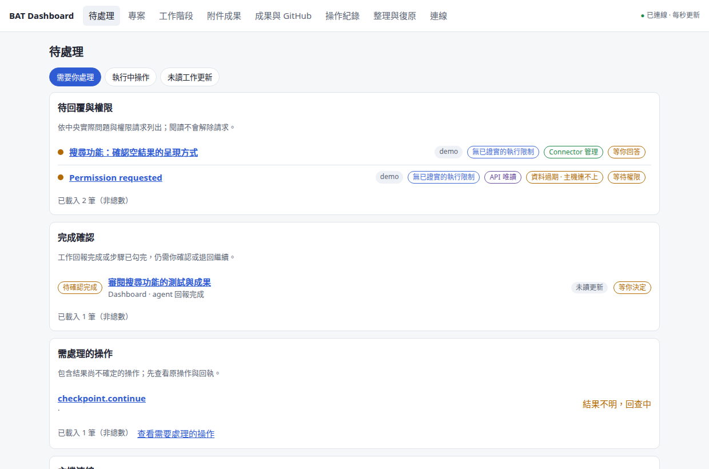
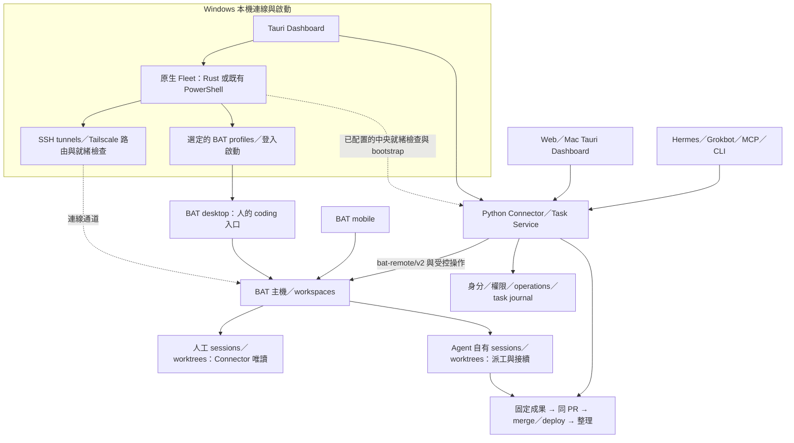

# Better Agent Dashboard

**看清每個 Agent 的進度，從原始需求一路追到成果交付。**

[English](README.md) · **繁體中文** · [專案網站](https://teddashh.github.io/bat-agent-connector/?lang=zh-TW) · [開始使用](docs/getting-started.zh-TW.md)

Better Agent Dashboard 整合 **Windows Fleet 連線與啟動、BAT 主機上的 Agent 工作，以及成果交付**。Windows 原生 Fleet 管理選定連線、SSH tunnel、BAT profiles 與登入啟動；Python Connector／Task Service 接受派工並追蹤操作；**Web 與 Tauri 共用 Dashboard**，讓你查看主機、sessions、worktrees、專案和成果，再追到 PR／部署。

你繼續在 [Better Agent Terminal（BAT）](https://github.com/tony1223/better-agent-terminal) coding；Hermes、Grokbot 等 Agent 透過各自的身分協作。Repository 與 Python 套件仍叫 **`bat-agent-connector`**，Connector 是 Dashboard、CLI 與 MCP 共用的後端。

> **產品方向：**安裝桌面包後，由程式準備並啟動背景服務，引導接上 BAT 環境，再點一下開 Dashboard。**目前實作：**共用 Dashboard 與中央背景服務已具備，但自動建立環境仍在開發。現有驗證安裝包仍需要已配置的中央服務與 API 身分。[安裝現況與試用方式 →](docs/getting-started.zh-TW.md)



*這是 `15b2048` 產品基準的實際共用前端，使用合成展示資料，不是使用者主機的驗收結果。[截圖來源](site/images/README.md)。*

## 內容導覽

[功能](#你可以用它做什麼) · [工作流程](#從需求走到交付) · [架構](#web桌面程式與-agent-的關係) · [Windows Fleet](#windows-fleet-與資源) · [平台](#平台與安裝包) · [開始使用](#開始使用) · [權限與復原](#權限工作歸屬與復原) · [現況](#目前證據與尚待完成的工作) · [文件](#文件索引) · [開發](#參與開發)

## 你可以用它做什麼

| 你想知道的事 | 到哪裡看 | 提供的能力 |
| --- | --- | --- |
| 登入後要連哪些主機、開哪些視窗？ | **Windows 連線設定／Fleet** | 分別選擇背景連線、BAT profiles 與 Dashboard；查看 tunnel／BAT／中央就緒狀態、Tailscale 登入、目前 backend 與啟動／遷移結果。 |
| 現在有什麼需要我處理？ | **待處理** | 分開列出待回答／權限、完成待審、操作問題與主機連線；閒置不直接當成整份工作完成。 |
| 這個專案有哪些工作？ | **專案** | 工作項目、原始需求、驗收條件、repository 綁定及派工關聯；支援階層、釘選與封存。 |
| 下一份工作要派去哪裡？ | **專案派工／工作階段** | 選擇已配置的 repository、主機與工作區，檢視固定 commit，加入指示、模型及附件，建立 managed session。 |
| Agent 正在做什麼？ | **工作階段** | 最近對話、程式碼與表格、待回答問題、資源來源及資料新鮮度；已授權控制走中央操作。 |
| 它產生了什麼成果？ | **附件成果／工作詳情** | 不可變的附件版本、digest、擷取、審閱及來源 operation、execution 或 task。接受附件不會自動 merge 或完成任務。 |
| 幾份成果如何進同一個 PR？ | **成果與 GitHub** | 選擇 managed 工作、checkpoint 或 branch 的固定成果，在獨立工作區預覽並整合；可直接貼 GitHub PR 網址。 |
| 是真的部署了，還是只跑完 CI？ | **成果與 GitHub** | 分開記錄整合、merge 與部署；已配置的 recipe 核對實際部署版本及 runtime 證據。 |
| 這個 worktree 可以整理嗎？ | **整理與復原** | 先看實際資源、保留內容及不能移除的原因；符合條件才整理，歷史與關聯仍可查詢。 |
| 斷線前的操作成功了嗎？ | **操作紀錄／歷史** | 保存 durable ID、原始請求及回執；先查回原操作，不因回覆遺失就再派一份。 |

畫面依帳號、主機與 repository 設定開放功能，並說明不可用的原因。一般專案派工不必每次再建立一份 Task Service recipe。

## 從需求走到交付

1. **整理專案。** 明確連結已配置的 repository，保留需求與驗收條件。
2. **決定執行位置。** 選擇 BAT 主機與工作區；從已發布程式碼開工時，可輸入 `main` 等分支，再檢視固定 commit。換入口不會搬走工作區。
3. **建立 Agent 自己的工作。** 操作保存指示、選用模型與附件精確版本；Connector 對人的原始 checkout 保持唯讀。
4. **在原專案追蹤。** 找回派出的工作、session、operation 與成果入口。「已啟動」只表示啟動成功；活動、驗證、接受及交付是不同狀態。
5. **審閱與整合。** 檢視候選 commit 和整合預覽，把選定成果加入同一個 PR，再以適當身分審閱並 merge 固定範圍。
6. **部署與整理。** 有部署 recipe 時，追到實際 runtime 版本與健康證據；之後審閱可整理的資源，保留歷史與成果。

同主機可從固定本機 checkpoint 接續。另一台主機則透過**明確綁定的 GitHub repository 與已發布 commit**取得程式碼，不搬運未發布工作區，也不自動 pull 或 reset 人的原目錄。

## Web、桌面程式與 Agent 的關係



**這些是不同責任，必須一起保留。** Windows Fleet 管理本機連線、就緒與啟動；Connector 是派工、權限與帳本的中央；BAT 在選定主機執行 coding sessions。人的 BAT desktop／mobile 與 Agent 各自的 managed 資源都在架構裡。GitHub 是已發布程式碼與交付的整合路徑。

Project Hub 只作為 session 整理與互動的參考；本產品沒有改用它的 runtime、資料後端或 importer。Mac／Web 共用管理介面，不表示 Windows 原生 Fleet 已移植到 Mac／瀏覽器。

**一份前端，一套中央服務。** Web 與 Tauri 都由 `desktop/src` 建置。Python 提供 `/dashboard/` 及 `/api/v1`；Tauri 包裝相同介面，以受限的 Rust transport 連線，不另建業務後端、排程器或帳本。

- 兩個入口可同時開著。關分頁或 Dashboard 視窗不會停止中央工作；關掉本機 tunnel 可能讓該 client 斷線。
- 專案、工作項目、操作及「工作項目版本已讀」保存在中央；草稿與對話閱讀位置仍各入口獨立保存。
- 原生憑證、選檔、系統匣／Dock、Fleet 與更新依平台提供；Web 不因此取得本機控制權。
- MCP／CLI 沿用中央政策與 durable operations，每個自動化 client 使用自己的身分和 scopes。

正式安裝器應負責自有本機服務的生命週期：準備 runtime 與身分、背景啟動、連線恢復，以及點一下開網頁。**「連接既有中央」是加入現成環境的進階路徑，不是新使用者的正常起點。**安裝器這一段尚未完成；[首次安裝合約](docs/design/managed-installation.md) 記錄必須補齊的行為。

[共用前端](docs/design/shared-frontend.md) · [原生 client](docs/design/desktop.md) · [API](docs/design/api-v1.md)

## Windows Fleet 與資源

Windows 是完整產品的一部分。已整合的 native Fleet 控制不因共用 Web／Mac 介面而消失：

| 能力 | 現有實作與入口 |
| --- | --- |
| 背景連線與路由 | 依既有 inventory／SSH／profile 綁定維護選定 tunnel，檢查 Tailscale 與已配置路由；使用有次數上限的復原，不接管未知程序。 |
| BAT 與中央就緒 | 分別檢查 tunnel、TLS pin、BAT 身分／workspace、中央 observe 權限；有開 port 不等於就緒。 |
| 視窗與登入 | 連線、BAT profiles、Dashboard 獨立選擇；登入選擇器、已保存啟動選項、關窗留背景、單一視窗恢復。 |
| Backend 與 ownership | 已接入 Rust runtime；舊設定未指定 backend 時沿用 PowerShell。明確遷移、正常停止舊 owner，再啟新 owner。 |
| Tailscale 與中央啟動 | Tailscale 狀態／開啟既有登入程式；另可透過已配置的固定 SSH recipe 查詢／啟動指定中央服務。不是任意遠端安裝。 |
| 本機資源 | Windows Credential Manager、原生選檔／附件上傳與另存、系統匣及受控更新入口。 |

**Windows Fleet 與中央的平台要求分開看。** 現有 Windows client 可連接 Linux 中央；自動準備完整 runtime 的安裝器仍是另外要完成的交付。Mac 的 DMG／Keychain 證據也不能取代 Windows Fleet 的實機驗收。

[Windows 使用與資源指南](docs/windows.zh-TW.md) · [NSIS 驗證包](https://github.com/teddashh/bat-agent-connector/actions/workflows/desktop.yml) · [Fleet 設定範例](desktop/fleet.example.json) · [Rust Fleet 原始碼](desktop/fleet-core/README.md)

## 平台與安裝包

目前**桌面 client** 與**中央服務**的平台要求不同。

| 元件 | 已有證據 | 目前限制 |
| --- | --- | --- |
| Web Dashboard | 中英雙語響應式介面，由中央提供 | 使用可信 loopback／tunnel；公開或 LAN hosting 需要另外設計已認證入口。 |
| Windows 桌面 | x64 NSIS、Credential Manager、原生 Fleet／BAT profile／登入控制；CI 驗證安裝與 WebView 生命週期 | 完整實機 Fleet 驗收仍須完成；尚未打包／自動建立 Python 中央。 |
| macOS 桌面 | Apple Silicon／Intel DMG；WebView、生命週期及隔離 Keychain 測試 | 目前 ad-hoc 驗證簽署；Developer ID／公證與 Mac 更新通道仍待完成，不能推論 Windows Fleet 已跨平台。 |
| Linux 桌面 | Debian 驗證包與原生 WebView fixture | 原生憑證只支援記憶體來源，尚無受保護的持久登錄。 |
| Python 中央／CLI／MCP | Linux 上測試 Python 3.10–3.13；依賴 POSIX | 本文以 Linux 為中央設定路徑。Windows 原生中央尚未實作；Mac client 測試不代表 Mac 中央實機驗收。 |

到成功的 [desktop workflow](https://github.com/teddashh/bat-agent-connector/actions/workflows/desktop.yml) 執行頁面，在 **Artifacts** 下載驗證包，核對 commit 與中央相容性。GitHub 可能要求登入，artifact 也會到期；它不是穩定發行通道。

[2026-10-10 候選](https://github.com/teddashh/bat-agent-connector/actions/runs/38032723037) 含 Windows、Mac ARM64／x64、Linux 包，測試的 source tree 與已合併 `15b2048` 相同。本文件基準時尚無正式 GitHub Release；後續發行請查看 [Releases](https://github.com/teddashh/bat-agent-connector/releases)。

## 開始使用

**預期的正常流程**是：安裝 → 背景服務就緒 → 引導連接 BAT／GitHub → 開 Dashboard。使用者不應先裝 Python、手改 JSON 或自行理解 API actor；必要的帳號登入與授權仍由你完成。這是產品要求，不是目前安裝包已完成的宣稱。

如果你要**現在進行有人監督的試用**：

- **環境已配置：**開啟現有 Web Dashboard，或用維護者提供的位址與身分接上桌面 client。先看待處理、專案與工作階段。
- **Windows 已有 BAT／Fleet 環境：**依 [Windows 指南](docs/windows.zh-TW.md) 核對既有 inventory、連線選擇、backend 與 BAT profiles；不把 Linux 中央設定當成 Windows 功能的替代品。
- **由你建立第一套環境：**依 [Linux 中央設定指南](docs/getting-started.zh-TW.md) 安裝、匯入 BAT、啟動服務、發出身分，再連線桌面程式。
- **接入 Agent：**在 MCP client 註冊 `bat-agent-connector-mcp`；中央觀察使用 `--principal-only --read-only`，授權操作則透過私人設定給專屬的 `BATC_API_TOKEN`。

工作在遠端 BAT 主機時，Dashboard 這台電腦不必安裝 BAT。[共用 skill 與 Hermes／Grokbot 配接](docs/agent-skills.md)。

## 權限、工作歸屬與復原

**主機開關與帳號權限是兩件事。** Host 的 `writes`／`orchestrate` 決定可提供的工作類型；API scopes 決定身分可做的操作。資源歸屬、目前版本、repository 綁定及 task coordinator 檢查仍會生效。

| 資源／情況 | 行為 |
| --- | --- |
| 人建立的 session／worktree | Connector 唯讀；從已檢視的固定來源建立新 managed 資源接續。 |
| 來源不明 | 沒有既存建立證據就維持 unknown；相同路徑不足以證明管理權。 |
| Managed 工作 | 經中央 handler 與 coordinator 規則執行已授權操作。 |
| 派工後回覆遺失 | 保留 operation、原 key 與 reservation，先查回；逾時不等於沒執行。 |
| Agent 宣稱做完 | 提交審閱；接受與活動、驗證、merge、deploy 分開。 |
| 整理碰到 active／未對帳工作 | 保留並說明，不清掉結果未知的操作或歷史。 |

MCP／CLI 寫入保留明確確認、主機權限及稽核；UI 已檢視的操作直接走中央，不再請 LLM 重複批准。

**Connector 唯讀政策不等於 OS sandbox。** Agent process 能否寫入人的資料夾仍取決於主機帳號與 confinement。一般 start 和 Task Service recipe 有已記錄差異；承諾無人值守隔離前，須核對 [confinement](docs/design/confinement.md)。

原生 BAT `worktree.merge` 若 ACK 完全未知且沒有充分正向證據，仍缺完整人工裁決 API。這是特定限制；GitHub 整合和部署有自己的讀回合約。[Merge 復原](docs/design/worktree-merge.md) · [資源政策](docs/design/resource-policy.md) · [安全說明](SECURITY.md)

## 目前證據與尚待完成的工作

基準：**2026-10-10，已合併 `15b2048`／PR #74**。以下描述該候選版本。

| 證據 | 可證明範圍 |
| --- | --- |
| [Python CI](https://github.com/teddashh/bat-agent-connector/actions/runs/38032723049) | Python 3.10–3.13 通過；本機 3.13 全套為 3,228 passed／33 skipped。 |
| 共用前端檢查 | 全套 694 項 UI 通過，最後排版另跑受影響回歸；HTTP／native transport fixture 不等於原生安裝。 |
| [Desktop CI](https://github.com/teddashh/bat-agent-connector/actions/runs/38032723037) | Windows、兩種 Mac、Linux 打包及 native fixtures；安裝測試使用受控 loopback 與合成資料。 |
| 真中央整合 fixtures | 實際 Python API、journal、暫存 Git，搭配假的 BAT／GitHub provider；不是正式 merge／deploy 驗收。 |

交付仍須完成**自動建立環境的安裝器**、正式簽署／發行／更新、特定 unknown-ACK 復原，以及在選定主機、網路和部署目標跑完整工作日。有人監督的試用與長時間無人值守，是不同的 ready 宣稱。

[實作紀錄](docs/product/implementation-status.md) · [驗收矩陣](docs/product/acceptance-v2.md)

## 文件索引

| 主題 | 指南 |
| --- | --- |
| 首次使用 | [繁中指南](docs/getting-started.zh-TW.md) · [English](docs/getting-started.md) · [設定範例](examples/hosts.example.toml) |
| 產品與安裝 | [共用決策](docs/product/realignment-v2.md) · [Managed 安裝要求](docs/design/managed-installation.md) · [工作項目](docs/design/work-items.md) |
| 桌面／Web | [共用前端](docs/design/shared-frontend.md) · [Tauri](docs/design/desktop.md) · [Fleet](docs/design/desktop-fleet-native.md) · [更新](docs/design/desktop-updates.md) |
| Windows／Fleet | [使用與資源](docs/windows.zh-TW.md) · [登入／視窗](docs/design/desktop-fleet-native.md) · [路由](docs/design/fleet-routes.md) · [Tailscale](docs/design/tailscale-recovery.md) · [中央啟動](docs/design/fleet-bootstrap.md) |
| 派工 | [Managed start](docs/design/session-start.md) · [已發布 repository](docs/design/repository-sync.md) · [Checkpoints](docs/design/checkpoints.md) · [Task Service](docs/design/task-service.md) |
| 成果 | [附件](docs/design/artifacts.md) · [整合](docs/design/integration.md) · [Merge／部署](docs/design/delivery.md) · [整理](docs/design/cleanup.md) |
| 自動化 | [API](docs/design/api-v1.md) · [Operations](docs/design/operations-unification.md) · [Agent skills](docs/agent-skills.md) · [協定](docs/PROTOCOL.md) |

## 參與開發

```bash
uv sync --locked --extra dev
uv run ruff check .
pytest-disktmp uv run pytest -q

cd desktop
npm ci
npm run build:all
npm test
npm run test:ui
```

`pytest-disktmp` 是開發主機的磁碟暫存 wrapper；若沒有，使用獨立、位於磁碟的 `--basetemp`，並在結束後刪除。絕不可使用 `/dev/shm` 或其他 tmpfs。詳見 [CONTRIBUTING](CONTRIBUTING.md)、[AGENTS.md](AGENTS.md)；backend 變更另須 Python 3.10 全套。

只改 `desktop/src` 的共用 UI，再重建 browser assets。專案網站在 `site/`，詳見[網站維護](site/README.md)。自動測試不得對真 BAT 主機寫入。

## 致謝與授權

本專案是非官方 companion，**與 BAT 作者沒有隸屬關係，也未經背書**。BAT 由 [TonyQ／tony1223](https://github.com/tony1223) 與貢獻者開發。協定筆記最初依 BAT v3.2.12 整理，BAT 更新後仍須核對相容性。

[Project Hub](https://github.com/kieiken/project-hub) 提供部分整理與互動參考；本產品沒有 Hub snapshot importer 或 runtime 依賴。[採用評估](docs/product/project-hub-frontend-audit-2026-10-09.md)。

MIT · [LICENSE](LICENSE) · [第三方聲明](THIRD_PARTY_NOTICES.md) · [更新紀錄](CHANGELOG.md)
