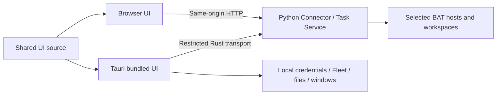

# Shared Web and Tauri frontend

The product owner confirmed on 2026-10-09 that Web remains a supported interface
alongside Tauri. Both use `desktop/src`; the browser is not a frozen v1 dashboard.

The Connector already serves `/dashboard/` and `/api/v1` from the same service.
It runs independently of open browser tabs or desktop windows. Tauri packages its
own static assets; it does not need a second web server or business backend.
Fleet can manage local connections separately, so closing a connection can make
that client unreachable without stopping central tasks.

| Concern | Shared behavior | Platform difference |
| --- | --- | --- |
| Projects, work items, sessions, messages, pending requests | Same central reads, actions, permissions and receipts | HTTP in browser; restricted IPC/Rust transport in Tauri |
| Operations and reconciliation | Central authority, stable IDs, original request/key, version checks | Two explicitly submitted user actions remain two intents; opening two clients does not itself dispatch work |
| Updates from other clients | Refresh from the central event journal | Current frontend polls; event processing is not a human read receipt |
| Credentials | Same principal/scopes contract | Browser has its own login; native uses the supported OS store / native enrollment |
| Files | Same artifact identity, revision and digest | Browser upload/download; supported native picker, handle and Save As |
| Fleet, tray, native updater, local BAT launch | Expose only supported capabilities | Native controls are not simulated by privileged web endpoints |
| Work-item reading markers | Explicit versioned reads in the central journal; independent of approval | Same effective principal shares markers across Web/Tauri; no chat unread count |
| Drafts, focus and conversation reading position | Same UX rules and identity isolation | Local to each browser/app; cross-device draft/conversation-position synchronization is not implemented |

The present server checks loopback Host and same-origin requests. Existing verified
tunnels remain the supported access path. Public/LAN web hosting needs a separate
authenticated ingress design; this change does not relax Host, Origin or CSP.

`npm run build:all` produces both the desktop bundle and generated Python-served
browser assets. CI checks regenerated browser files for drift. An installed older
desktop cannot change with a web deployment: API version/capability checks remain
necessary, and missing native features need an explicit explanation. UI behavior
tests exercise both transports; mock IPC is not real WebView/platform acceptance.

## First adoption slice: conversation reading

See the [Project Hub audit](../product/project-hub-frontend-audit-2026-10-09.md),
C01/C02/C04. This implementation is independently written; upstream is the UX
reference, not a new dependency or copied runtime.

- Format fenced code and pipe tables, with limited inline code/bold. Preserve the
  complete original message for copying; unsupported syntax remains literal text.
  Construct DOM nodes with text content, never HTML, external links or remote images.
  Unclosed streamed fences remain code, and code copying preserves original line endings.
  Bound formatting work; large inputs remain fully available as plain text.
- Keep the existing latest-30 read contract. A scrollable conversation follows new
  output only when the reader is near its bottom. An explicit latest button resumes
  following. Refresh captures the reading position when applying the result, not
  before its network request; unchanged message nodes retain selection/focus.
- Prefer supplied message IDs for reading anchors. Without IDs, match exact message
  content/metadata and duplicate occurrence only for presentation, never as domain
  identity. If an anchor leaves the loaded window, show that limitation rather than
  claiming old messages were retained. Do not infer unread counts from this state.
- Clipboard access happens only on an explicit copy click. Success follows the
  write result; failure exposes selectable original text. Identity/navigation guards
  prevent delayed copy UI from showing content in another mounted account/view.
- Keep drafts, operation envelopes, pending questions, read failures and event ACK
  barriers unchanged. Reading and copying do not issue central mutation requests.

Acceptance covers English/zh-TW, browser/IPC, 390/768/1440 layouts, hostile content,
exact copying, stream updates, rolling read windows, delayed/failed refresh, selection
and focus, and loss of clipboard access. Native OS clipboard/keyboard acceptance is
separate from browser and injected IPC fixtures.

## Attention and work updates

The shared home separates replies/permissions, completion review, operation problems
and host connections. Active operations have their own tab. Unread work updates use
[central versioned reading markers](work-item-reading.md); only an explicit click in
work-item detail marks the displayed version read. Reading in either client refreshes
the other, without approving the item or clearing pending requests. Lists show loaded
counts, retain their paging depth on refresh, and keep prior rows with a stale-read
notice on failure. This capability is additive; older centrals keep the attention
categories without offering unsupported reading controls.

## Project dispatch

The project detail links to a shared [published-version composer](repository-sync.md).
It filters explicit central repository bindings by project, freezes the previewed
project version, and offers the existing attachment draft flow plus optional title
and model. Web and Tauri submit the same durable `repository.continue` envelope;
neither creates a second scheduler. A changed project invalidates the preview while
retaining the draft, and a lost response retries the original operation key.
Drafts remain local to each client and isolated by server, principal and project.
Central capability version 1 gates the new entry; same-host unpublished continuation
continues through checkpoints. Browser/IPC fixtures also exercise real central
admission, temporary Git and verified attachment bytes (`npm run test:dispatch`).

## Entry and recovery clarity (2026-10-10)

Before authentication, shared navigation exposes only Connection. A deep link keeps its URL but
renders the connection screen; no project/session content is inferred without authentication.
The router retires this screen's polling just like an authenticated view. Native initial configuration
has one primary action. Configuration file paths and operational explanations are expandable;
configured endpoint, actor and credential source stay visible. Fleet/Tailscale are mounted after
initial configuration. This presentation does not provision a central service or issue credentials.

Session origin starts unknown. A failed first read cannot assert manual ownership; only a successful
observation with `provenance=manual` displays that message. Write gates remain unchanged.
`session.start` and `repository.continue` successful receipts say Started; they do not assert task completion.

The published composer accepts short branch names and converts them to `refs/heads/…` before preview.
It never accepts tags or arbitrary refs, never changes a frozen request, and preserves its exact SHA/key.
Delivery accepts a credential-free public GitHub PR URL as a convenience for filling its labeled
repository/number controls. The URL is not fetched: central authorization still owns every request.

Project creation optionally lists the repositories in central's existing published-work bindings.
The user explicitly selects a repository; the existing `project.create` operation stores that choice.
The project's dispatch composer still filters host/workspace choices against current capabilities.
This does not configure a new binding or create an extra Task Service task.
